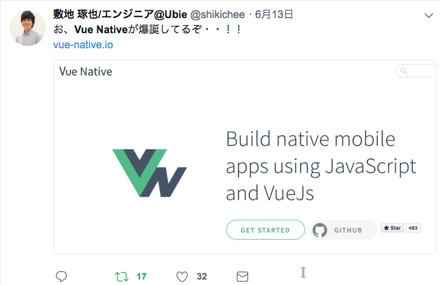
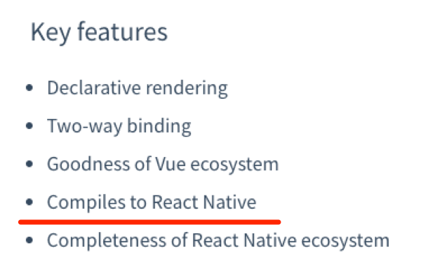
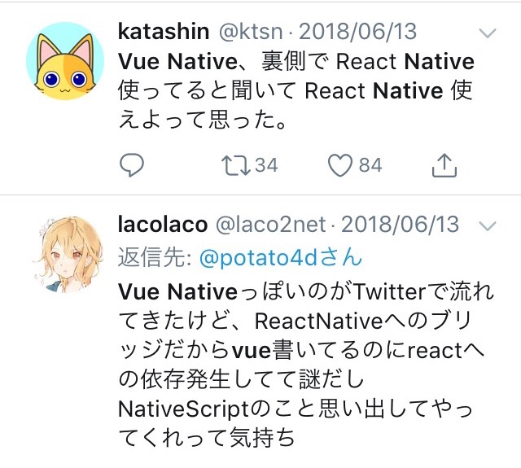
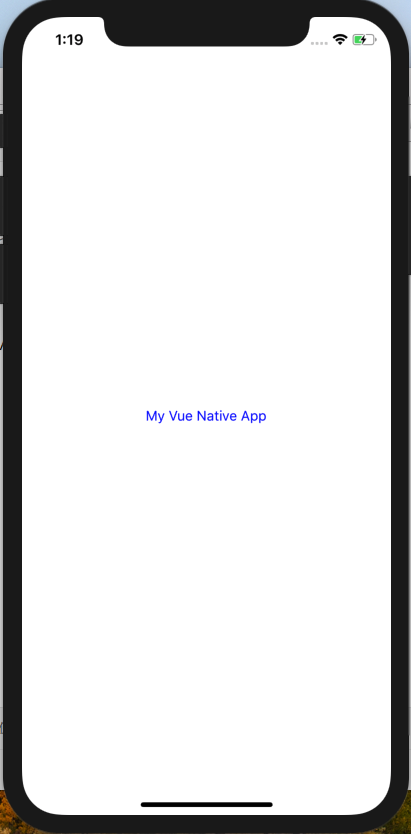

# Vue Native<br>やってみた
<div class="auther">果物リン@FruitRiin</div>
<div class="date">
2018/6/23  
【第2回】React （JSフレームワーク他）  
x ビアバッシュ 初心者勉強会 in秋葉原
</div>

---

## 自己紹介 - 果物リン
- Twitter@FruitRiin
- 某ソシャゲ会社勤務（開発運用保守）
- 職業PHPer
- 趣味JSer
 - Vuejsはいいぞ
- Vueハンズオン講師やってみた（1回）
- PHPカンファレンス関西スピーカーやります！

気になった人は懇親会で聞いてみて！

Note:
自分のことはどうでもいいので飛ばします。

---

## 参加の経緯
「（その他フロントエンド）言うても  
　メインはReactなんじゃろ？  
　Vueの出る幕なくない？」  
「React vs Riotみたいになってる」  
「なんだとRiotには負けてられるか」

<br>

気づいたら申し込んでました

---
## テーマについて
### Vueの魅力とは

- 圧倒的学習コストの低さ
 - 開発メンバーの入れ替わりに強い
   - （まだ）書けない人との協業
 - デザインに強いマークアップ担当との協業
   - templateとscriptの分離

Note:
Vueめっちゃ好きなんですよ。

簡単に始められてサクッと作れるところとか、  
HTMLとCSSの知識がそのままUIに適用できるところとか。

つまり学習コストの低さが一番の魅力だと思っています。

例えば、デザイン寄りのマークアップしてる人とか  
そういう人がメンバーにいたり、協業してるようなチームに  
Reactでの開発を求めるのは酷だなぁというシチュエーションで  
VueはまさにFitしたフレームワークといえるでしょう。

このあたり詳しく聞きたい人はあとで直接聞きに来てください。

---

### 刺さるテーマを考える

- Vueはこの場ではアウェイ
- Reactを飲み込めた人に  
あえてVueを勧めたい理由がない
- なにかいいテーマはないものか


 
---?color=#2F2F44


 <div class="attention font-overall">🤔</div>

---



---?color=#2F2F44

 <div class="attention font-big">こ、これだ！</div>


---

# How about<br>Vue Native

---
## Key Features
<center>

</center>

！？
---

## 界隈の反応

<center>


ですよね。

</center>


---?color=#2F2F44

 <div class="attention font-overall">😇</div>

---

 <div class="attention font-big">
Anyway, let’s do this
 </div>


---?color=#2F2F44

## traped - need React
```
    at Module._compile (module.js:649:30)
  status: 127,
  signal: null,
  output: [ null, <Buffer >, <Buffer > ],
  pid: 2409,
  stdout: <Buffer >,
  stderr: <Buffer > }
Please globally install create-react-native-app dependency
```
@[8](devendencyに入れないのかよ)

---?color=#2F2F44

### traped - need watchman

```
> react-native-scripts start

12:56:26: Unable to start server
See https://git.io/v5vcn for more information, either install watchman or run the following snippet:
  sudo sysctl -w kern.maxfiles=5242880
  sudo sysctl -w kern.maxfilesperproc=524288

npm ERR! code ELIFECYCLE
```
@[4](watchmanが必要です)


---?color=#2F2F44
### traped - failed to install watchman

```
############################### 100.0%
==> make html
Error: An unexpected error occurred during the `brew link` step
The formula built, but is not symlinked into /usr/local
Permission denied @ dir_s_mkdir - /usr/local/Frameworks
Error: Permission denied @ dir_s_mkdir - /usr/local/Frameworks
```
@[5](sudo mkdir /usr/localFrameworks からの再トライでOK)

---
### Hello World

<center>

 動いた！
</center>
---?color=#2F2F44

### Vue Native Code
```
<template>
  <view class="container">
    <text class="text-color-primary">My Vue Native App</text>
    <text class="">Hello World</text>
  </view>
</template>
```

めっちゃVueや！  
※ scriptブロックももちろん使えます

Note:
今見えてるコードはテンプレートだけですが、
scriptもcssもVueと同様に使えます。

---?color=#2F2F44
## Basic Components
### テキスト入力

```
<template>
    <text-input
        :style="{height: 40, borderColor: 'gray', borderWidth: 1}"
        v-model="text"
      />
</template>
```
タグ1個！

---?color=#2F2F44

## Basic Components
### ボタン

```
<template>
    <button
        :on-press="onPressLearnMore"
        title="Learn More"
        color="#841584"
        accessibility-label="Learn more about this purple button"
    />
</template>
```
タグ1個！（パラメータいっぱいあるけど！）


---?color=#2F2F44

## Vue Native Facts
- 「React Nativeのエコシステムが使えます」  
「Vueは？」「そこそこ」🤔
- 「Routerどうなった？」  
「Vue Native Routerを用意しました」  
「Vue Router死んでるじゃねーか！」

既存のUIコンポーネントとかは全滅だと思います

---

## Vue Native RoadMap

- Slotこれからです
- デバッグちょい簡単にします
- $emitもこれからやります」 
 - 「子から親にイベント飛ばねーのかよ！」
- etc, etc....


---
## 感想

- とはいえ公式のBasic Componentsを見た感じ  
思ったよりVueっぽい
 - 意外とマトモなのでは？
- React Nativeがワンチャンあった
- Vue Nativeワンチャンあるかも！

---


<div class="attention font-big">
Vueはいいぞ 💪
</div>
<div class="date">Fin.</div>