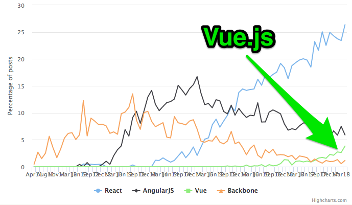
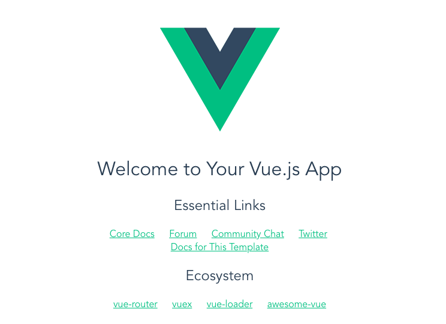
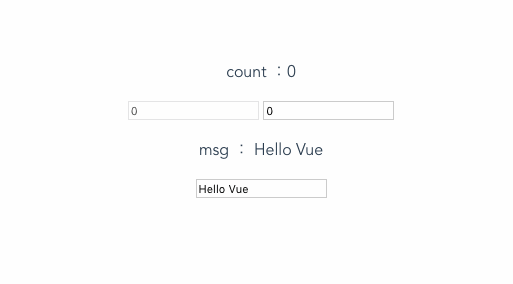
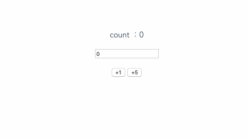
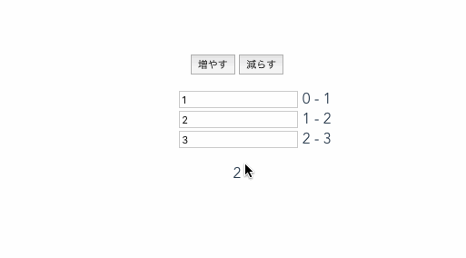
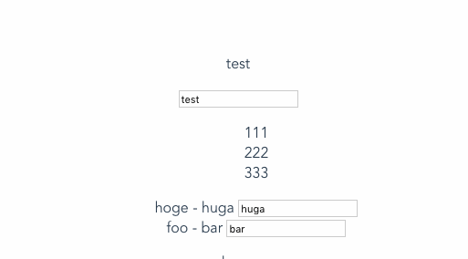

# Vue.js ハンズオン!
果物リン@FruitRiin
<div class="date"> 2018/05/25 - nakameguro.php #03</div>

Note:
・Vue.js ハンズオンということで  
　・Vueが好きなんですよ  
　・発端は社内向け  
　・中目黒.phpというmeets upと掛け合わせたら大盛況で驚いている  
　・これはやはりVue.jsきてるのでは？  
　・vue-meetsup tokyo参加できなかった話  
　　・人数  
　　・参加者がいたら話聞きたい  
・是非お酒を飲みながら参加してほしい  


---
<center>

</center>
 
 <div style="text-align:right">\#nakameguro_php</div>

---?image=bg/orange.png
## 突然ですが

---?image=bg/orange.png

## アンケートします。
Note: 
・ハンズオンなのでレベル感をちょっと知りたい  
・参考程度なので気楽に  
・質問は４つ  

---?image=bg/orange.png

### プログラミング経験は？

- 概ね日常的に使う
 - 仕事/OSS
 - 趣味で作ったものをリリースした
- やってたことがある
- 勉強中

Note:
・プログラミング勉強中っていう人がここに来てたらちょっと驚く  
・もしいたらこの場で色々得て帰ってほしい


---?image=bg/orange.png
### 使えるプログラミング言語は？

- JavaScript
- PHP
- Ruby
- Go
- Java/C#
- その他

Note:
・使えるっていうレベルも曖昧だけど  
・まあ基本的なシンタックスわかるよ、くらいで  
・ここはnakameguro.phpですよ

---?image=bg/orange.png

### JavaScript の経験は？

- これから挑戦します
- jQuery使ってました
- ES6(or later)はいいぞ　　


- node.js おいしいです
- React 使ってます
- Angular 使っています
- Vue.js 使ってます

Note:
・これから、jQUery使ってました  
　・ES6入門っていう記事をざっと目を通して一旦置いとくといいよ  
　・JavaScriptの規格にバージョンがあってそれをEcmaScriptっていう  
　・ハンズオン中普通にES6シンタックスが出てくるけどわからなければそのまま書いてほしい  
　・InteliJのIDE使ってたらデフォルトES5で怒られるかも。ES6に書き換えよう  

・フレームワークの話です  
・React/Angularの人はなぜ今回聞きにきてくれたのか気になる  
・Vueの人は当たり前すぎてそんなに価値ないと思う  

---?image=bg/orange.png
### 本日の手元のOSは？

- Windows
- Mac
- Unix/Linux
 - WSL/Docker は便宜上ここに含めます

Note:
Windowsの人がいたらどうしよう  
ちなみにWSLの人います？

---?image=bg/orange.png

### アンケートは以上です

Note:
なお、個人的な興味も含んでいます。

---

# Vue.js ハンズオン

https://github.com/fruitriin/slideshows/tree/vueJsHandsOn

Note:
やっていき

---?image=bg/navy.png
### 必須環境

- npm がインストールされている
- **npmにパスが通っている**
 - npm -v
- **globalのnode_modules/.binにパスが通っている**
 
```
#今回だけnode_modules/.binのパスを通すなら
SET PATH=$PATH:`npm bin -g`
```

---

### 推奨環境
- Mac/Linux OSであること
 - Windowsは大変かも？

---

### いきなりですがvue-cliインストール
- 発表と平行して環境構築
- ダウンロードに時間がかかると予想中
- うまくできない人は手をあげて！

Note:
ダウンロードのステップが3回ある  
手を上げるとチューターさんが助けてくれますよ！

---?image=bg/navy.png
## ハンズオン ステップ1.
### vue-cli インストール
- シェルを立ち上げてこのコマンド
```bash
$ npm install -g vue-cli
```
- vue-cliがインストールされます

Note:
グローバルじゃなくてもいいけど説明しない。自己責任  
vue-cliのパスが通ってれば大丈夫だと思う


---

### ハンズオン中のお願い
- 詰まったら片手を手を上げて
- 前半の環境構築までは全員でやる
- できた人は周りの人に教えてあげて！

Note:
・さっき手を上げてって言ったけど改めて  
・後半はスライド見てどんどんいけるならやっちゃっていいよ  
・終わった人は周りの人を助けてあげて

---?image=assets/profile.jpeg&position=bottom 2em right 3em&size=6em auto&color=#33B490

 ## 講師 自己紹介
 ### 果物リン@FruitRiin

- 株式会社ORATTA所属  
 - ソーシャルゲーム開発・運営
- サーバーサイドエンジニア  
 - ぺちぺちしている
- JSが好き  
 - Vue.jsはいいぞ！


Note:
（このあとステップ2なので可能な限り全員ができるのを待つ）  
・ここの社員  
・喋りかけるの下手エンジニア。話しかけて！  
・すごいものを作っているわけではないと思う  
・どやーってしたいからいっぱいアピールしてたら今回は講師になった  
・ぺちこん関西にも登壇することになった。ドキドキ。  


---

一応社内インフラでこんなの作りました

---?image=bg/navy.png

## ハンズオン ステップ2.
### プロジェクトの作成

```
$ vue init webpack proj_name
```

- proj_name はお好みのプロジェクト名でどうぞ
Note:
よく hoge とかやります

---?image=bg/navy.png

### 色々聞かれるので答えていく

```
$ vue init webpack proj_name
? Project name > (空)
? Project description (空)
? Author (空)
? Vue build → standalone 
? Install vue-router? No
? Use ESLint to lint your code? No
? Set up unit tests No
? Setup e2e tests with Nightwatch? No
? Should we run `npm install` for you after the
 project has been created? (recommended) npm
```

@[2](package.jsonのnameになる。空だとinitしたときのproj_name)
@[3](package.jsonのdescription。空だと"A Vue.js project")
@[4](package.jsonのauther。空だとgit？の設定が入る)
@[5](デフォルト選択肢でEnter。<br>runtimeのみ版はテンプレートが使えないのでやめよう)
@[6](n : vue-routeなし)
@[7](n : ESLintなし)
@[8](n : unit testなし)
@[9](n : e2e testなし)
@[10-11](デフォルト選択肢でEnter : npm install される。<br>yarn使いならyarnを選んでもいい)

Note:
ちなみにこのステップで2回ダウンロードが走るので  
一斉にやるともしかしたらかなり時間がかかるかも

---


## <center><strike>Keep It Simple, stupid.</stike></center>

Note:
KISSの原則ってあるよね。

---


# <center>Vue.js is...</center>

Note:
Vue.jsってどんなの？って話をします。
最初にジョークをはさみますのでまあ気楽に。

---

<center>


<p>知ってるか？</p>

(フロントエンド)<br>
フレームワークは3つに分けられる
</center>
Note:
Did you know, there are three kinds of frameworks?

---
<center>


<p>JSにHTMLを入れたやつ</p>

HTMLにちょっとJSを入れたやつ

</center>

Note:
Those what html into js,  
those what js with html.
---
<center>


<p>やたらとメジャーバージョンが上がるやつ</p>

この３つだ。あいつは……

Note:
and those what major upgrade too many.  
Those are the three. And that -
</center>


---

## <strike>Vue.js ハンズオンです。 <br> 宗教戦争ではありません。</strike>

Note:
はい。  
・ここ笑うところですよ  
・深夜テンションでこの辺のスライドつい作ったけどウケなかったらどうしよう  
・まぁ消さなかったんだけど  
（ウケなかったら）  
・忘れましょう。  

---
## Vue.jsのいいところ

Note:
そんなの知ってるよ！って人いたら聞き流しておいてください。

---
### 今話題のフレームワーク

<center>


<p>HackerNews 2018年4月までのトレンド</p>
</center>

---
そんなにすごくないのでは……？
<strike>調べると思ったほどじゃなくて焦る</strike>

---
## Anyways...

Note:
まぁ集まってきていただけたわけですし……

---

### デザイナでも覚えやすい！
- 描画用のコードがとってもシンプル
 - HTML+vue.js拡張属性で覚えやすい

---
### テンプレートサンプル
```
<template>
  <div id="app">
    
    <HelloWorld v-if="isShow"/>
    <button v-on:click="clickAction">
  </div>
</template>
```
@[5](クリックしたときにclickAction実行)
@[4](isShowがtrueならこのコンポーネント（やタグ）を表示<br>（入れ子なら子供以下も全部）)

---

### エンジニアも覚えやすい！
- 双方向データバインディング
- リアクティブな変更の追跡
 - 値が変わると描画も一緒に変わる
 - 関心の分離！
- 変数の状態を考えることに集中できる！

Note:
リアクティブプログラミングってやつです

---?image=bg/navy.png
### スクリプトサンプル（抜粋）
```
  data(){
    return { isShow : false}
  },
  methods: {
    clickAction() {
      this.isShow != this.isShow;
    }
  }
```
@[1-3](コンポーネントが持つプロパティ)
@[4-8](コンポーネントが持つメソッド)
@[5-7](clickActionメソッド)
@[6](実行のたびに this.isShowの真偽を反転)

Note:
基本的にはdata()で宣言したプロパティが監視対象で、  
ここで宣言したプロパティならそれに依存する描画が自動的に反映されていく


---

### メモ：
- コンポーネント間は単方向データバインドが基本
 - *オブジェクトを渡すと双方向になる*
   - **密結合なコンポーネント間ならいいかも？**
   - ~~マサカリ飛んできそう~~ 

Note:
世間一般ではコンポーネント間はprops doown, event upとか  
データバイパス用コンポーネントを定義して共有するとか  
Vuexを使ったりするらしい
---

### コンポーネントで分割 1.
- 使いまわせるパーツを「コンポーネント化」
 - Webの世界にDRY原則！
- Scoped CSS
 - 「CSSいじって変なところ崩れた」から開放！

→ 全体に統一感を持ったサイトを作れる！


---
### コンポーネントで分割 2.
- レイアウトを「コンポーネント化」
 - ページによってコンポーネントを切り替える

→ SPA作るのにもいいぞ！

---

### スケールするVue.js
- ライブラリを追加してプロジェクトを拡張
- ルーターとFlexが公式ライブラリにある
 - vue-router, vuex, vue-loader, vuefire
 - vuepress
 - vue-devtools, vetur...

Note:
Progressive Frameworkとはこのこと  
Reactと比べて、routerとvuexが公式なのは地味にいいところ  
程よく結合度が高くてコードが短くて済む

---

## なぜVueなのか
- 動くHTMLが書けるイメージ
  - ReactはJavaScriptの中にHTMLを書く<br>＝ReactとVue.jsはアプローチが逆
- デザイナとプログラマの分業がしやすいらしい
- さらに導入が簡単！
- ref: [他のフレームワークとの比較 — Vue\.js](https://jp.vuejs.org/v2/guide/comparison.html)

Note:
（次のスライドで起動ステップ）  
まとめました


---?image=bg/navy.png
## ハンズオン ステップ3.
### ついに…起動！

```
cd proj_name #まだprojectのディレクトリに移動していなければ
npm run dev
```

- localhost:8080 で公開されます！
 - ポートの埋まり具合で8080ではないかも
 - npm run devしたときの表示に従う

---?image=bg/navy.png
### ブラウザでアクセスできないとき
- 起動したけどブラウザでアクセスできない？！
- ポート8080が埋まってるとダメっぽい
- 起動ポートの指定を変更する

config/index.jd
```
module.exports = {
  dev: {
//中略
    port: 8083, 
  },
//後略
}
```
@[4](起動のデフォルトポートを変えよう)


---
<center>


<p>実行結果</p>
</center>
---

## 逆に普通？

---

## そんなことはありませんよ！

---

# Vue.js ハンズオン！

---
### 進行上の決め事
App.vue
```
<template>
templateタグ
</template>

<script>
//scriptタグ
</script>

<style scoped>
styleタグ（今回は使わない）
</style>
```

@[1-14](.vueファイル＝単一Vueコンポーネントファイル)
@[1,3,5,8,10,12](template, script, styleタグで囲まれた要素を持つ)
@[1-3](template、HTMLを書く)
@[5-8](script、JavaScriptを書く)
@[10-12](style、CSSを書く)

Note:
- 一つのコンポーネントに関わるtemplate,script,styleを.vueファイルとして一つにまとめられる
- srcで参照させれば中身を別のファイルに書き出すこともできる
- templateではルートノードは単一でないと怒られる
- scriptでVueのコンポーネントをJSで書く
- styleにはCSSを書く 
 - scopedをつけるとそのコンポーネントにしか効かないCSSになる
 - なければ普通のCSSと一緒、グローバルスコープ 
---
styleタグのハイライトおかしいな？
---

### リアルタイム更新Web開発(HMR)

---?image=bg/navy.png
&lt;template&gt;タグ
```
<template>
  <div id="app">
    
    <HelloWorld/>
  </div>
</template>
```
[proj_name]/src/App.vue

@[1-6](ブラウザと一緒に表示しながら)
@[4](Helloworldコンポーネントタグを消してみましょう)

---?image=bg/navy.png

&lt;template&gt;タグ
```
<template>
  <div id="app">
    
    <!-- <HelloWorld/> -->
  </div>
</template>
```

@[4](コメントアウトでもOK)

---
### 実行結果
<center>


<p>更新していないのに反映される</p>
</center>

---

地味に便利です

---

## データバインディング

---?image=bg/navy.png

### dataにプロパティを作る

&lt;script&gt;タグ
```
export default {
  data(){
    return {
      count : 0,
      msg : "Hello Vue"
    }
  }
}
```

@[2-3,6-7](dataは関数でなければならない)
@[4](this.count = 0)
@[5](this.msg = "Hello Vue")

---?image=bg/navy.png
### リアクティブを確認
&lt;template&gt;タグ

```
  <div id="app">
    <p>count ：{{count}}</p>
    <input disabled v-bind:value="count">
    <input type="number" v-model.number="count">
    <p>msg ： {{msg}}</p>
    <input type="text" v-model="msg">
  </div>
```
- inputタグをそれぞれcountとmsgにバインド
 - スコープはこのコンポーネント
- テンプレート文字列で変数とJSは {{hoge}} で表示
- タグで変数とJS式は v-bind:property

Note:
基本は文字列  
v-model.numberで数値キャスト  
テンプレートの展開はJS式が実行できる  

---
### ちゃんとハイライトしたかった
- 変なところで改行される
- 行ハイライトされない
- なんかGitPitchのバグっぽい

---
### 実行結果
<center>


<p>値の入力と出力のDOM操作不要！</p>
</center>
---

### 早くできた人向け課題
- disabledなinputの値を<br>内部で保持する値の2倍にする
 - ヒント：JS式として処理する
- バインドした2つの変数の掛け算
 - dataに数値の変数をもう一つ用意
 - バインドするinputタグを1個追加
 - テンプレート内で2つの数値を掛け算
  - テンプレートのブランケットもJS式で評価

---

## メソッドの定義と実行

---?image=bg/navy.png
### methods を生やす

&lt;script&gt;タグ
```
export default {
  data(){
    return {
      count : 0
    }
  },
  methods : {
    increment(){
      this.count++;
    },
    increments(x = 1){
      this.count += x;
    }
  }
}
```
@[7,14](methods を生やす（methodではない）)
@[6](,を忘れない)
@[8-10](increment メソッドを定義（引数を使わない）)
@[11-13](increments メソッドを定義（引数を使う）)

---?image=bg/navy.png

### ボタンで実行

&lt;template&gt;タグ
```
  <div id="app">
    <p>count ：{{count}}</p>
    <input type="number" v-model="count">
    <p>
      <button v-on:click="increment">+1</button>
      <button v-on:click="increments(5)">+5</button>
    </p>
  </div>
```
- +1 ボタンをクリックした時にincrementを実行
- +5 ボタンをクリックした時にincrementsを実行

Note:
v-onで引数を省略したメソッド名で実行はオブジェクトのプロパティアクセス

---
### 実行結果
<center>


<p>処理をまとめておける！</p>
</center>

---
### 早くできた人への課題

- inputで数値の入力ボックスを作る  
ボタンを押すとその数だけcountが増加する

---

## 表示/非表示の切り替え

---?image=bg/navy.png
### boolのプロパティを生やす
&lt;script&gt;タグ
```
  export default {
    data(){
      return {
        isShow : false
      }
    }
  }
```

@[4](bool値のプロパティを生やす)

---?image=bg/navy.png
### ボタンの配置
&lt;template&gt;タグ
```
  <div id="app">
    <button v-on:click="isShow = !isShow">切り替え</button>
    <div v-if="isShow">
      消えたりかくれたり
    </div>
  </div>
```
@[3-5](v-ifが設定されたdivタグで囲む)
@[2](buttonを押すたびにisShowの値を入れ替える)

Note:
- 子要素まるごと消える
- v-ifでelseのときはDOM上からいなくなる
- v-on はJavaScriptのシンタックスなので変数の操作を直接できる
 - あまり行儀はよくない


---
### 実行結果
<center>


<p>表示したりが簡単！</p>
</center>

Note:
- DOM要素からも消える

---

## 配列とループ
---?image=bg/navy.png

### 配列の宣言

&lt;script&gt;タグ

```
export default {
  data(){
    return {
      lists : [1,2,3]
    }
  }
}
```
@[4](dataに配列listsを定義)

---?image=bg/navy.png

### 配列の表示、ループ

&lt;template&gt;タグ
```
  <div id="app">
    <ul>
      <li v-for="item in lists">{{item}}</li>
    </ul>
    <p>{{lists[1]}}</p>
  </div>
```
- {{配列[キー]}}で特定の要素へアクセスできる
- v-for="要素in 配列" でループで表示
- v-for="(要素, キー) in 配列"もできる

Note:
- コンソールを見るとv-bind:keyがないと警告がでる  
- なきゃないで動きはする
- パフォーマンスに影響するらしい

---?image=bg/navy.png
### 配列のキー（添字）を使う
```
<li v-for="(item,key) in lists">{{key}} - {{item}}</li>
```

<br>

### 警告を消す
```
<li v-bind:key="item" v-for="item in lists">{{item}}</li>
```

---?image=bg/navy.png

### 配列の操作
&lt;script&gt;タグに追加
```
  methods:{
    push(){
      this.lists.push(this.lists.length+1);
    },
    pop(){
      this.lists.pop();
    }
  }
```
@[2-7](methodsの中に入れること)
@[](リロードしないと反映されないかも)

---?image=bg/navy.png

### 増減ボタンの配置

&lt;template&gt;タグに追加
```
    <button v-on:click="push">増やす</button>
    <button v-on:click="pop">減らす</button>
```
- 押すたびに増えたり減ったり

---?image=bg/navy.png
### ループの中でもv-model

&lt;template&gt;タグのループ中に追加
```
    <input v-model.number="lists[key]>
```
- 「ループの親配列のキー」でv-modelできる
 - 直接 v-model="item"とかできない


---
### 実行結果
<center>


<p>配列が扱える！</p>
</center>

Note:
- テンプレート上アクセス先が消えると空文字列が入る
 - メソッドから呼び出されたりしなければ警告もでない
- レンダー初回時にアクセスできないと警告が出たりする

---

## オブジェクトを扱う

---?image=bg/navy.png
### オブジェクトの宣言
&lt;script&gt;タグ

```
export default {
  data(){
    return {
      user : {
        name : "test",
        phoneNumbers : [111,222,333],
        others: {
          hoge : "huga",
          foo : "bar"
        }
      }
    }
  }
}
```
@[4-12](オブジェクトのuserを定義)
@[5-11](各プロパティ)
@[6](オブジェクトの中の配列)
@[7-10](オブジェクトの中の子オブジェクト)

---?image=bg/navy.png

### オブジェクトをテンプレートに表示

&lt;template&gt;タグ

```
  <div id="app">
    <p>{{user.name}}</p>
    <ul>
      <li v-for="item in user.phoneNumbers">{{item}}</li>
    </ul>
    <ul>
      <li v-for="(item, key) in user.others">{{key}} - {{item}}</li>
    </ul>
    <p>{{user.others.hoge}}</p>
  </div>
```
- 要素を取り出すのは {{オブジェクト.キー}}
- 配列、オブジェクトの要素をループもOK

---?image=bg/navy.png

### オブジェクトの値にv-model
&lt;template&gt;タグに追加

```
<input v-model="user.name">
```

- オブジェクトのプロパティにv-modelできる

---
### 実行結果
<center>


<p>オブジェクトが扱える！</p>
</center>


Note:
ハンズオンここまで

---

## ハンズオンは以上です！

Note:
小さくてシンプルなWebアプリケーションならこれでできる  
コンポーネント化については今回のハンズオンでは扱わない

---

## 他のVue.js機能ピックアップ

- 算出プロパティ
 - 使われているプロパティが変化したら再計算
- ウォッチャ
 - プロパティを監視、変化したら実行
- 子コンポーネントとスロット
 - 親から渡されたコンテキストを展開
- mixin
 - 継承みたいなやつ

---
## まとめ

いかがだったでしょうか？

「簡単にできそう！」  
「使っていきたい！」
「来てよかった！」

そういう言葉が聞けたらいいなと思います。

---

Vue.jsが持つ機能はまだまだたくさんあるので、  
物足りなくなったら公式サイトへ。  

えっ、こんなことできたの？みたいな  
発見を得られるかもしれません。


- [Vue\.js公式サイト](https://vuejs.org/)

---

# Fin.


---

### 余談：本番用にビルド
- npm run dev は開発用
- 本番にデプロイするときはオプションが別
 - devの代わりにbuild

```
npm run build
```
- コンパイル結果はプロジェクトのdist下へ
- ビルドの設定は build/* と config/*

Note:
キャッシュ対策にハッシュがつく  
不要なら build/webpack.prod.conf.js をいじる
