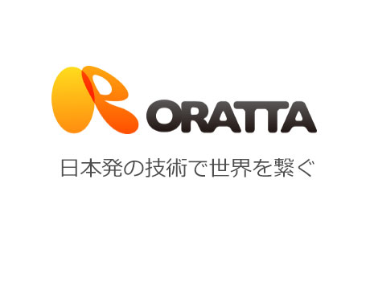
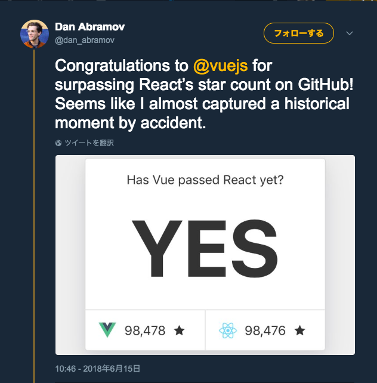

# あえて<br>PHPerにすすめる<br>Vue.js入門

<div class="auther">
株式会社ORATTA  
中島 凜 (果物リン@FruitRiin)
</div>

<div class="date">PHPConference関西2018</div>

Note:
- 東京でエンジニアをしている
- きっかけPHPerKaigi2018でテンションが上がってCfPを申し込んだ
- PHPカンファレンス関西という場に立てて光栄である

---?image=assets/selfy.jpeg

## 自己紹介
<div style="float:right; width:200px">

</div>

- 株式会社ORATTA 
 - ソシャゲの企画開発運営
 - サーバーアプリケーションエンジニア
- 趣味JSer
 - Vue.jsはいいぞ！

Note:


---

## 株式会社ORATTA

<center>

</center>

戦国アスカZEROとか作ってます。  
PWA版『戦国アスカZEROクイック』をリリースしました！(2018.6)

Note:
お勤めなのでちょっと自社の紹介させてください。

---

## 戦国アスカZERO

<center>

</center>

なでなでするほど強くなるRPG  
App Store, Google Play  
Chrome, Yahoo! Mobagee

---
## 全国CM打ちました(2017.9)
<center>

</center>
この顔にピンときたらORATTAです。

Note:
一般公開用スライドでは非表示にすること

---
## Next Project is Laravel
<center>

with Game
</center>

このロゴにピンときたらORATTAです？

Note:
このロゴとゲーム作りのキーワードにピンときたらORATTAです！

---
## We are Hireling

<center>

</center>
このロゴにピンときたらORATTAです。
Note:
東京の会社ですが、ゲームづくりに興味がある人は会社のホームページも見てみてください。


---

<div class="attention font-big">
はい。
</div>
Note:
会社紹介おわり。お勤め終了でございます。

---
# あえて<br>PHPerにすすめる<br>Vue.js入門


Note:
戻ってきました。

---
## お品書き
- あなたにとっての最初のPHP経験は？
- なぜ「Vue.js」なのか
- Vueの始め方 Laravel編
- Vue.js 基本のSyntax紹介（ライブコーディング）
- 付録

---

# 最初のPHP経験は？

---

## 初めてのPHP経験は？
- 初めてPHPに触れた頃を思い出してみてください
 - PHPといえばテンプレートエンジンだった
  - echo "&lt;html&gt;"; 😇
 - smarty とかでHTMLを書く
 - JSは片手間に書くもの

とにかく我々もUXを提供していた！

Note:
- 私にとっても初めてのPHP
- 大学でCとJavaを学んでいた
- TwitterAPIを叩いてリストに表示してテキストエリアから登録したかった
- そのためのPHP
- echo HTMLとか本当にやった
- 最初の仕事も smartyとかで、jsは片手間で……
- とにかくUXを

---

<div class="attention font-big">
few years later...
</div>

---
## 2018年におけるPHP

- モダンなPHPの主な仕事といえばAPIサーバー
 - ajaxで呼ばれてjsonを返す
- テンプレートエンジンでHTMLを返す
 - Twig, Jade

Note:
- 最近はとりあえずフレームワークに乗っかる 
- Laravel, Symphonyとかいろいろ
- さらに最近は要件的に json を返すのが主な仕事ってところも増えてるのでは？
- もちろんテンプレートエンジンを使う仕事だってあるでしょう
- 適材適所


---

## 2018年におけるWeb

- とりあえずインタラクティブ
- とりあえずajax
- なんにせよ動く

Note:
- とはいえとはいえ
- とりあえず触ってその場で動くのが今のWebだ
- ちょっとしたことでページ遷移はさみたくない

---

<div class="attention font-big">
PHPは静的ページしか  
提供できない
</div>

---

<div class="attention font-big">
JSが必要
</div>

---

## やりいこと ＝ APIを作ること？

ちょっとだけ考えてみてください  

「フロント部分を作るのも好き！」  
そんな人もきっといるはず

そんなあなたに  
是非今日のセッションを聞いてください

Note:
- APIがないとフロントエンドは成り立ちません  
- データを加工するのが好きな人もきっといると思う、それでいい

- フロントを作るのも楽しいぞっていう方に聞いてほしい
 - フロント？jQueryだよね？
 - jQueryつらいよね
 - Bootstrapでは物足りないなあ


---

# なぜ「Vue.js」？

---

## 2018年における<br>Frontend Framework 3選


激動の2015〜2017年を経て  
この3つで落ち着いてきた

Note:
- ここしばらくフロントエンド界隈はまさに戦国時代
- GoogleのトレンドグラフだとReactがダントツ
- 次はAngular、ちょっとあけてVue.jsがきてる

---

## どれがいい？

「Laravel with Vue」
```
While Laravel (中略) does provide a basic starting point using 
Bootstrap and *Vue* that will be helpful for many applications. 
```

あのLaravelがVueを公式にプロジェクトに含めている！

---


---

## Vue.jsでしょ！


Note:
- 実際のところ、現在のシェア率でいうとReactが圧倒的に強い
 - ReactはJSXという記法でJavaScriptの中にHTMLを書く
- VueとAngularはHTMLに拡張プロパティを書くだけでいい
- 中でもVueは規模感小さめ〜中くらいで力を発揮する

---

# Vueの始め方 Laravel編

---
## Laravelで始めるVueの環境構築
- ……は、Qiitaに書いたのでダイジェストで
- [LaravelからVue\.jsを使う最短レシピとTips \- Qiita](https://qiita.com/fruitriin/items/e0f2c9aa035c3ff2c874)
- 新規Laravel5.6プロジェクトから3ステップでOK

---
## 最短レシピダイジェスト
### Vueをインストール
- Projectのディレクトリへ移動してnpm install
```
npm install
```
- laravelの package.json に従ってインストール
 - composer.json みたいなやつ

---
## 最短レシピダイジェスト
### Bladeを修正
- jsとcss読み込み用のタグを追加
- CSRFトークンをVue.jsへコードを追加
 - コードは割愛！それぞれ一行追加でOK

---
## 最短レシピダイジェスト
### 開発環境を起動
- LaravelとVueの開発環境を起動
```
php artisan serve &
npm run dev
```
- いろいろいい感じにしてくれる

---

# Vue.js Live Coding 

Note:
ライブコーディングしていきましょう
---
## リアルタイム更新

HMR.gif

- テンプレート部分を編集して保存すると即反映
- ブラウザのリロードなしで確認
 
地味に便利！

- methodsの編集とかは読み込まれないことがある
---
## 変数展開と双方向バインド

variable-bind.gif

- `{{hoge}}` で変数展開
- `<input v-model="hoge">` で双方向バインド

めっちゃ便利！

---
## イベントとメソッド

event-and-methods.gif

- タグに `v-on:click="show()"` でクリック時にshow()
 - click, change, submit... DOMのイベントハンドラ

---
## 表示/非表示、配列とオブジェクトのループ

if-and-loops.gif

- タグに `v-if="isShow"` で表示非表示
- タグに `v-for="elem in elems"` でループ表示
 - 配列の要素、オブジェクトの要素どっちもOK！

---
## Scoped CSS


---
# 諸々組み合わせて

MasterViewer.vue.gif

---

<div class="attention font-big">
Vue.js はいいぞ！
</div>

---

# 付録

こんな記事を書いてます

- Vue.jsを始める4つのヒント - Qiita
- My Fails of the Vue - Qiita

---
<div class="attention font-big">
さあVue.jsを  
やってみよう！
</div>
<div class="date">
Thanks.
</div>


